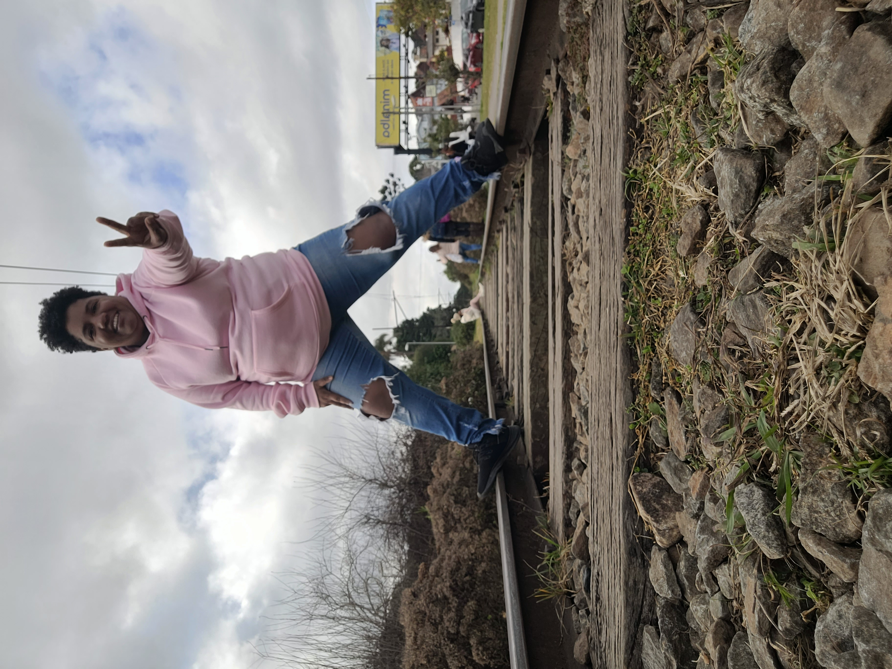
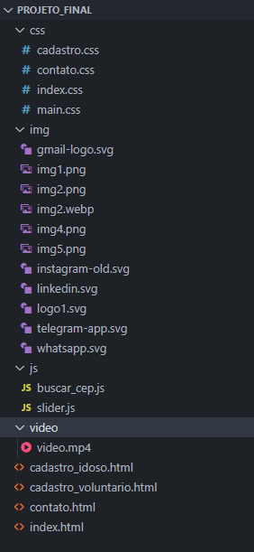

<h1  align="center">

</h1>

## Apresentação

### Quem é a Kelly Oliveira? 

[Kelly Oliveira](http://instagram.com/kelly_amenduuim), sou uma dev que a quase 2 anos se apaixonou por front-end, no momento estou em transição de carreira. Sonho em fazer algo que posso mudar vidas, acredito muito que a educação e a solidariedade é que muda a vida das pessoas.

#### Contatos

-  [E-mail](kelly.rodrigues.oliveira@gmail.com) 

-  [LinkedIn](https://www.linkedin.com/in/kelly-rodrigues-de-oliveira-21178132/) 

-  [GitHub](https://github.com/Kelly-Oliveira)

  ## Conhecendo o projeto

  O projeto Vóluntários é o meu projeto final do bootcamp de front-end da Reprograma. Constitui-se de conectar idosos que queiram companhia para uma determinada atividade (ir ao hospital, supermercado, entre outros) com pessoas voluntárias. Esse projeto foi pensado devido a minha vivência trabalhando em um hospital desde 2013, onde vejo diariamente pessoas idosas sozinhas e algumas vezes com dificuldades diversas.

  ### O site conterá 4 páginas:

* Home (o Sobre está no menu, mas está dentro da página Home)

* Cadastro de pessoas idosas

* Cadastro de pessoas vonluntárias

* Contato

  ### Todas as páginas terão os componentes:

* Menu

* Header

* Footer

## Estrutura do projeto
  
   
##  Tecnologias que utilizei
  
  | `HTML5` | Linguagem de Marcação de Hipertexto |

  | `CSS` | Linguagem de estilo |

  | `Javascript` | Linguagem de programação que permite as páginas de web ficarem interativas |

  | `API` | Mecanismos que permitem que dois componentes de software se comuniquem |

  | `Netlify` | Hospedagem para a aplicação, fiz o deploy integrado com o github |

  | `Github` | Hospedagem do código fonte integrado com gerenciador de versionamento |

  ###  `Como rodar o projeto localmente` 

Siga os passos e inclua as informações abaixo:

|&nbsp;&nbsp;&nbsp;&nbsp; Passo &nbsp;&nbsp;&nbsp;&nbsp;&nbsp;| &nbsp;&nbsp;&nbsp;Comando/informação &nbsp;&nbsp;&nbsp;|

| Faça o fork | `botão de forkar` |

| Faça o clone | `git clone` |

| Iniciar o projeto | Dê dois cliques no index.html |

## 💪 Desafios 

- Maior desafio desse projeto foi o tempo para execução.

- Outro desafio foi a falta de informações sobre algo do mesmo tema, nas minhas pesquisas sobre pessoas idosas o que achei era sobre casa de abrigo e/ou asilo ou moradores de rua.

## 😎 Próximos passos mapeados

- Deixar o site responsivo

- Acessibilidade para pessoas idosas

- Criar página onde aparece a tela com as atividades adicionadas pelos idosos

- Parceria com escolas e empresas

## Agradecimento
  Agradeço a minha família e aos meus amigos, por todo apoio e compreensão e mais um pouco de apoio rsrs.
  Agradeço muito a equipe da Reprograma.

  

  
